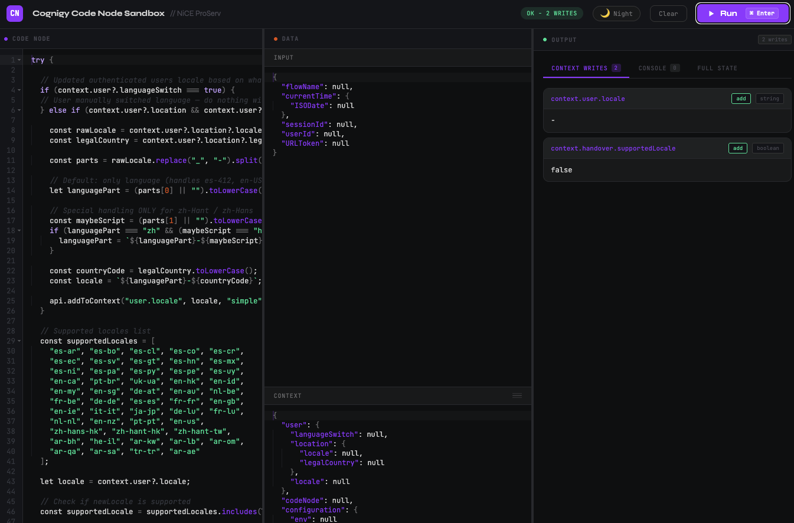
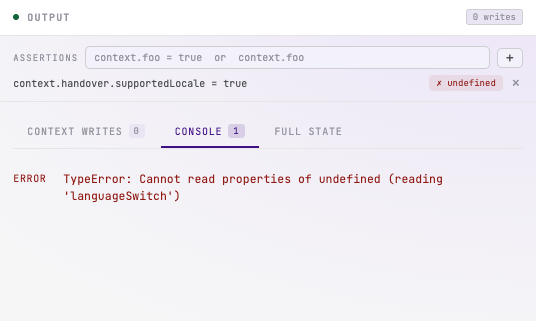
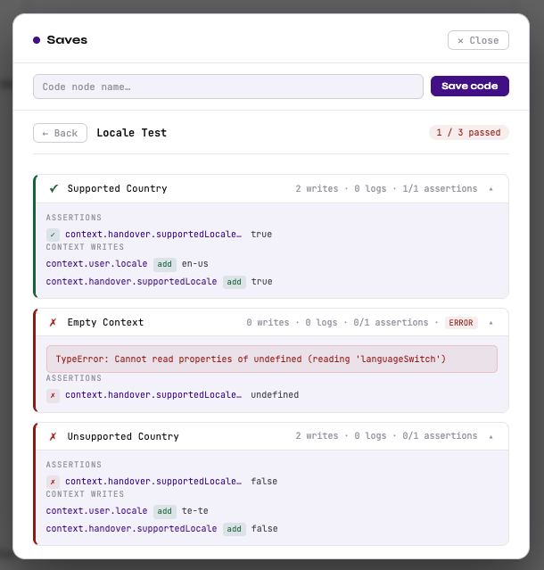
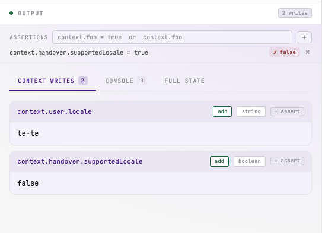
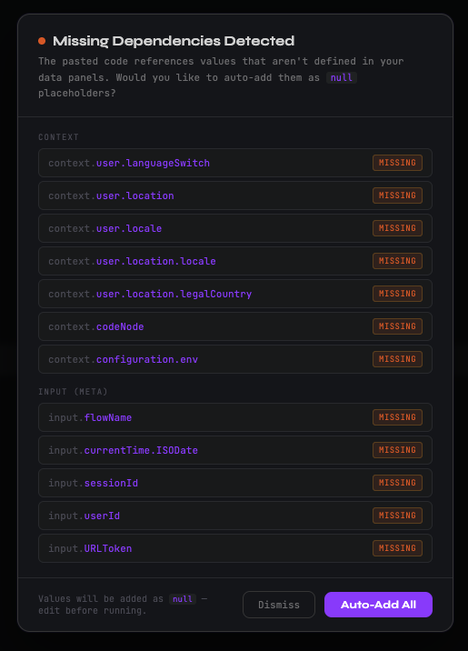

# Cognigy Code Node Sandbox

A browser-based tool for testing Cognigy Code Node JavaScript before deploying it to a live agent. Open the file, paste your code, configure the conversation state, and see exactly what your code does — no Cognigy login, no deployment, no setup required.

---

## Why use this?

Testing a Code Node normally means deploying to a live agent, triggering a conversation, and inspecting logs — a slow loop that makes it difficult to test edge cases or reproduce bugs reliably.

The sandbox removes that friction. You set up the exact conversation state you want to test, run the code, and immediately see every context change, console message, and error. You can save multiple test cases and run them all at once, with automatic pass/fail results.

## Getting started

Download `cognigy-node-sandbox.html` and open it in any modern browser. That's it — no installation, no account, nothing to configure.

The workspace has three panels side by side:

| Panel | What it's for |
|---|---|
| **Code Node** | Paste or write your Code Node JavaScript |
| **Data** | Set the conversation state your code will run against |
| **Output** | See what happened after the code ran |

You can drag the dividers between panels to resize them.

---

## Running code

1. Paste your Code Node JavaScript into the **Code Node** panel
2. Fill in the **Data** panels with the conversation state you want to test against
3. Click **Run** (or press `⌘ Enter` on Mac / `Ctrl Enter` on Windows)

The Output panel updates immediately.

---

## Setting up your data

The **Data** panel has three sections, each representing a different part of the Cognigy conversation state.

### Input

This is the `input` object your code will receive — the same object available inside a real Code Node. Set it to whatever the conversation state would look like at the point your Code Node runs.

Use the **Gen IDs** button to automatically generate unique session and user IDs if you haven't set them.

### Context

The `context` object as it exists when your Code Node begins executing. If your code reads from context (e.g. `context.accountId`), set those values here before running.

### Profile

The contact profile. If your code reads from or writes to the profile, set the starting values here.

> **Tip:** All three panels auto-save as you type. Your data will still be there when you reopen the file.

---

## Understanding the results

After a run, the **Output** panel shows three tabs:

**Context Writes** — every change your code made to context or profile, listed in order. For each write you can see the path that was set, the value, and the operation type (set, delete, etc.). If your code raised an error, it appears here too.

**Console** — everything your code printed with `console.log`, `console.warn`, or `console.error`, plus any Cognigy API calls like `api.say()` or `api.handover()`.

**Output** — the complete `input`, `context`, and `profile` objects as they exist after the run. Use this to verify the full picture, not just the writes.

---

## Saving test cases

The **Saves** button in the top bar opens the test case manager. This is useful when you want to test the same Code Node against different scenarios — for example, a happy path, a missing-data case, and an error case.

### How it works

Saves have two levels:

- **Code save** — a named version of your Code Node JavaScript (e.g. "Get Account Status")
- **Scenario** — a named snapshot of your Input, Context, and Profile data attached to a code save (e.g. "Happy path", "Missing account ID")

This means you write the code once and attach as many data configurations as you need.

### Creating a save

1. Write or paste your code into the Code Node panel
2. Open **Saves**, type a name, and click **Save code**

### Adding scenarios

1. Configure the Data panels for the case you want to capture
2. Open **Saves**, find your code save, type a scenario name, and click **Add**

The current data is saved under that name. Repeat for each test scenario you want.

### Loading saved work

| Action | What it loads |
|---|---|
| **Load code** | The saved JavaScript — your data panels stay as they are |
| **Load** (on a scenario) | The saved Input, Context, and Profile — your code stays as it is |

### Running all scenarios at once

When a code save has at least one scenario, a **▶ Run all** button appears. Clicking it runs the saved code against every scenario and shows a summary with pass/fail per scenario, expandable detail, and counts of context writes, console messages, and assertion results.

---

## Assertions

Assertions let you define what a successful run looks like. Instead of manually checking the output after every run, you write the expected values once and the sandbox checks them automatically.

The **Assertions** panel sits at the top of the Output pane. After every run — single or batch — each assertion shows whether it passed or failed, and what the actual value was.

### Writing assertions

Type an assertion into the input field and press **Add**. Two formats are supported:

| Expression | Passes when |
|---|---|
| `context.handover` | The value exists and is not empty |
| `context.handover = true` | The value exactly equals `true` |
| `context.locale = "en-GB"` | The value exactly equals `"en-GB"` |
| `context.retryCount = 3` | The value exactly equals `3` |
| `profile.escalated = false` | The value exactly equals `false` |

Use `context.` or `profile.` as the prefix, followed by the variable path.

### Capturing assertions from a run

After a run, each row in the Context Writes tab has a **+ assert** button. Clicking it creates an assertion pre-filled with the path and the value that was written — no typing needed. If an assertion for that path already exists, it updates to the new value.

### Editing assertions

Click any assertion's text to edit it inline. Press **Enter** to save or **Escape** to cancel.

### In batch runs

Each scenario is evaluated against your assertions individually. A scenario only passes if it ran without errors **and** every assertion passed. The batch results view shows the actual value for each assertion per scenario.

---

## Paste detection

When you paste code into the editor, the sandbox scans it for any `context.*`, `input.*`, or `input.data.*` references that aren't yet defined in your data panels. If any are found, a prompt appears listing the missing values with an **Auto-Add All** button — one click adds them as empty placeholders so you can fill them in before running.

---

## Documenting your code

The **Document with LLM** button in the Code Node panel header builds a ready-to-use prompt that instructs an LLM to add inline documentation to your code and return the fully documented result.

Clicking the button copies the prompt — with your code included — to your clipboard. A confirmation message appears below the header. Paste it directly into claude.ai, Microsoft Copilot, or any other LLM your team uses.

The LLM will return your code unchanged in structure, with:
- A plain-English summary comment block at the top
- Inline comments explaining non-obvious logic
- Notes on what each context variable read and write is for

No API key or account is needed — the sandbox handles no AI processing itself.

---

## Other controls

**Clear** — resets the code editor and all data panels back to empty. Your saved code and scenarios are not affected.

**Theme** — the toggle in the top bar cycles between Night, Day, and Auto (which follows your system setting). The choice persists across sessions.

---

## Planned Features
For planned features, see [ROADMAP.md](ROADMAP.md).

---

## What the sandbox can't do

- **No HTTP calls** — `api.httpRequest()` is not implemented. Simulate API responses by adding the expected result directly to the Input panel under the relevant key.
- **No async code** — Code using `await` or Promises will not behave correctly. The sandbox runs synchronously.
- **No NLU** — intent matching and slot filling are not simulated.
- **Extension node results** — results from extension nodes (e.g. `input.getAccountStatus`) need to be added manually as top-level keys in the Input panel.
- **Single turn only** — the sandbox runs your code once. To test multi-turn logic, set up the context manually between runs.
